# Use Case Diagram — SAPTA CBT

Dokumen ini berisi Use Case Diagram dari sistem SAPTA CBT yang menggambarkan interaksi antara setiap aktor (pengguna) dengan fitur-fitur sistem.

---

## Diagram Utama (Overview)

```mermaid
graph TB
    subgraph System["🖥️ SISTEM SAPTA CBT"]
        direction TB

        subgraph UC_AUTH["Autentikasi"]
            UC01["UC-01: Login"]
            UC02["UC-02: Logout"]
            UC03["UC-03: Edit Profil"]
            UC04["UC-04: Ganti Password"]
        end

        subgraph UC_MASTER["Manajemen Master Data"]
            UC05["UC-05: Kelola Tahun Ajaran"]
            UC06["UC-06: Kelola Jurusan"]
            UC07["UC-07: Kelola Kelas/Rombel"]
            UC08["UC-08: Kelola Mata Pelajaran"]
        end

        subgraph UC_USER["Manajemen Pengguna"]
            UC09["UC-09: Kelola Data Guru"]
            UC10["UC-10: Kelola Data Siswa"]
            UC11["UC-11: Import Siswa via Excel"]
            UC12["UC-12: Kelola Staf"]
        end

        subgraph UC_SOAL["Manajemen Bank Soal"]
            UC13["UC-13: Kelola Bank Soal"]
            UC14["UC-14: Buat Soal"]
            UC15["UC-15: Edit Soal"]
            UC16["UC-16: Hapus Soal"]
            UC17["UC-17: Publish/Draft Soal"]
            UC18["UC-18: Preview Soal"]
            UC19["UC-19: Lihat Riwayat Versi Soal"]
            UC20["UC-20: Upload Media Soal"]
        end

        subgraph UC_UJIAN["Manajemen Ujian"]
            UC21["UC-21: Buat Ujian"]
            UC22["UC-22: Edit Ujian"]
            UC23["UC-23: Hapus Ujian"]
            UC24["UC-24: Pilih Soal untuk Ujian"]
            UC25["UC-25: Tetapkan Peserta Ujian"]
            UC26["UC-26: Tambah Siswa Ekstra"]
            UC27["UC-27: Atur Ujian Susulan"]
            UC28["UC-28: Publish Ujian"]
            UC29["UC-29: Pause/Unpause Ujian"]
            UC30["UC-30: Hapus Peserta Terdaftar"]
        end

        subgraph UC_PELAKSANAAN["Pelaksanaan Ujian"]
            UC31["UC-31: Mulai Ujian"]
            UC32["UC-32: Mengerjakan Soal"]
            UC33["UC-33: Simpan Jawaban Otomatis"]
            UC34["UC-34: Navigasi Soal"]
            UC35["UC-35: Submit Ujian"]
            UC36["UC-36: Auto-Submit saat Waktu Habis"]
        end

        subgraph UC_MONITOR["Monitoring & Pengawasan"]
            UC37["UC-37: Monitoring Real-time"]
            UC38["UC-38: Lock Sesi Siswa"]
            UC39["UC-39: Unlock Sesi Siswa"]
            UC40["UC-40: Perpanjang Waktu"]
            UC41["UC-41: Paksa Submit"]
            UC42["UC-42: Tugaskan Proktor"]
            UC43["UC-43: Review Integritas"]
            UC44["UC-44: Tambah Catatan Review"]
        end

        subgraph UC_NILAI["Penilaian & Hasil"]
            UC45["UC-45: Penilaian Otomatis"]
            UC46["UC-46: Penilaian Esai Manual"]
            UC47["UC-47: Lihat Hasil Ujian"]
            UC48["UC-48: Publikasi Hasil"]
        end

        subgraph UC_LAPORAN["Analitik & Pelaporan"]
            UC49["UC-49: Lihat Analitik Ujian"]
            UC50["UC-50: Ekspor Hasil ke Excel"]
            UC51["UC-51: Ekspor Hasil ke PDF"]
            UC52["UC-52: Cetak Kartu Ujian"]
            UC53["UC-53: Cetak Daftar Hadir"]
            UC54["UC-54: Cetak Berita Acara"]
        end

        subgraph UC_SISTEM["Keamanan & Sistem"]
            UC55["UC-55: Lihat Audit Log"]
            UC56["UC-56: Lihat Info Server"]
            UC57["UC-57: Toggle Mode Maintenance"]
            UC58["UC-58: Backup Database"]
            UC59["UC-59: Download Backup"]
            UC60["UC-60: Lihat Dashboard"]
        end
    end

    SA(("👤 Super Admin"))
    KR(("👤 Kurikulum"))
    GR(("👤 Guru"))
    PR(("👤 Proktor"))
    SW(("👤 Siswa"))

    SA --- UC01 & UC02 & UC03 & UC04
    SA --- UC05 & UC06 & UC07 & UC08
    SA --- UC09 & UC10 & UC11 & UC12
    SA --- UC13 & UC14 & UC15 & UC16 & UC17 & UC18 & UC19 & UC20
    SA --- UC21 & UC22 & UC23 & UC24 & UC25 & UC26 & UC27 & UC28 & UC29 & UC30
    SA --- UC37 & UC38 & UC39 & UC40 & UC41 & UC42 & UC43 & UC44
    SA --- UC45 & UC46 & UC47 & UC48
    SA --- UC49 & UC50 & UC51 & UC52 & UC53 & UC54
    SA --- UC55 & UC56 & UC57 & UC58 & UC59 & UC60

    KR --- UC01 & UC02 & UC03 & UC04
    KR --- UC05 & UC06 & UC07 & UC08
    KR --- UC09 & UC10 & UC11 & UC12
    KR --- UC13 & UC14 & UC15 & UC16 & UC17 & UC18 & UC19 & UC20
    KR --- UC21 & UC22 & UC23 & UC24 & UC25 & UC26 & UC27 & UC28 & UC29 & UC30
    KR --- UC37 & UC38 & UC39 & UC40 & UC41 & UC42 & UC43 & UC44
    KR --- UC45 & UC46 & UC47 & UC48
    KR --- UC49 & UC50 & UC51 & UC52 & UC53 & UC54
    KR --- UC60

    GR --- UC01 & UC02 & UC03 & UC04
    GR --- UC13 & UC14 & UC15 & UC16 & UC17 & UC18 & UC19 & UC20
    GR --- UC21 & UC22 & UC23 & UC24 & UC25 & UC26 & UC27 & UC28 & UC29 & UC30
    GR --- UC37 & UC43
    GR --- UC45 & UC46 & UC47
    GR --- UC49 & UC50 & UC51
    GR --- UC60

    PR --- UC01 & UC02 & UC03 & UC04
    PR --- UC37 & UC38 & UC39 & UC40 & UC41 & UC43 & UC44
    PR --- UC47
    PR --- UC60

    SW --- UC01 & UC02 & UC03 & UC04
    SW --- UC31 & UC32 & UC33 & UC34 & UC35 & UC36
    SW --- UC47
    SW --- UC60
```

---

## Use Case Diagram per Modul (Terperinci)

### Modul 1: Autentikasi & Profil

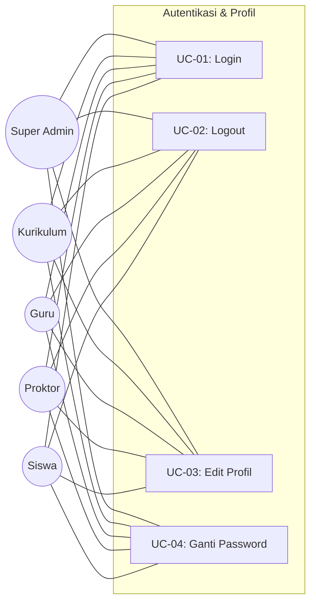

### Modul 2: Manajemen Master Data

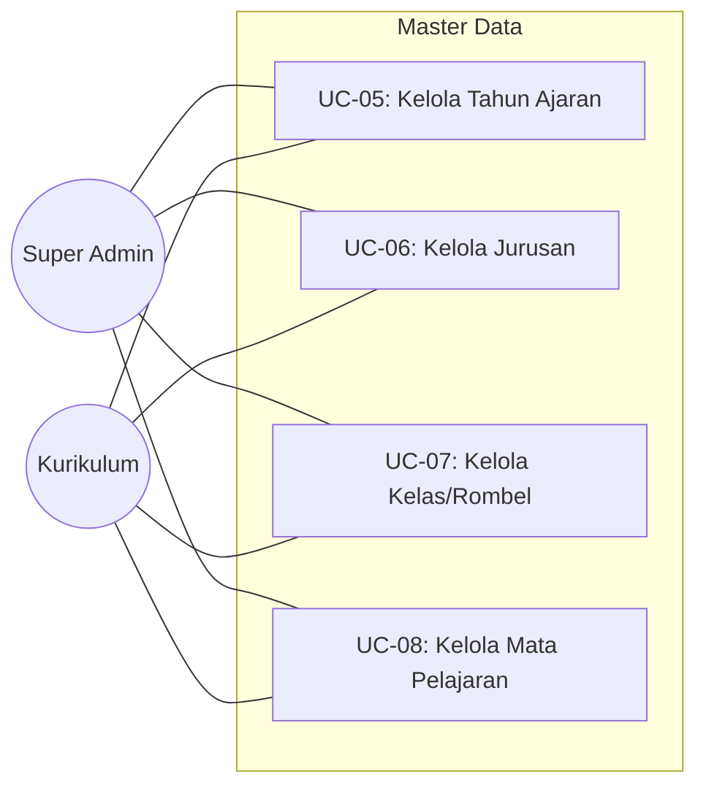

### Modul 3: Manajemen Pengguna

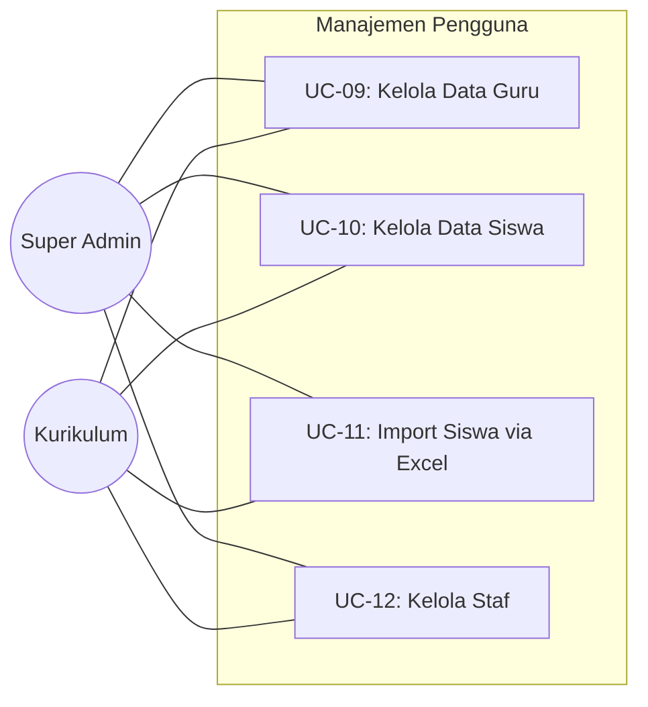

### Modul 4: Manajemen Bank Soal & Soal

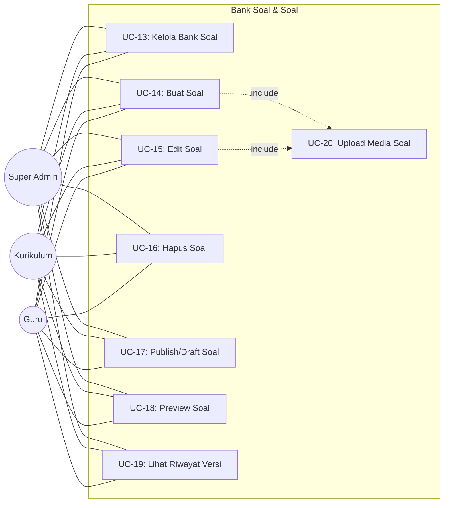

### Modul 5: Manajemen Ujian

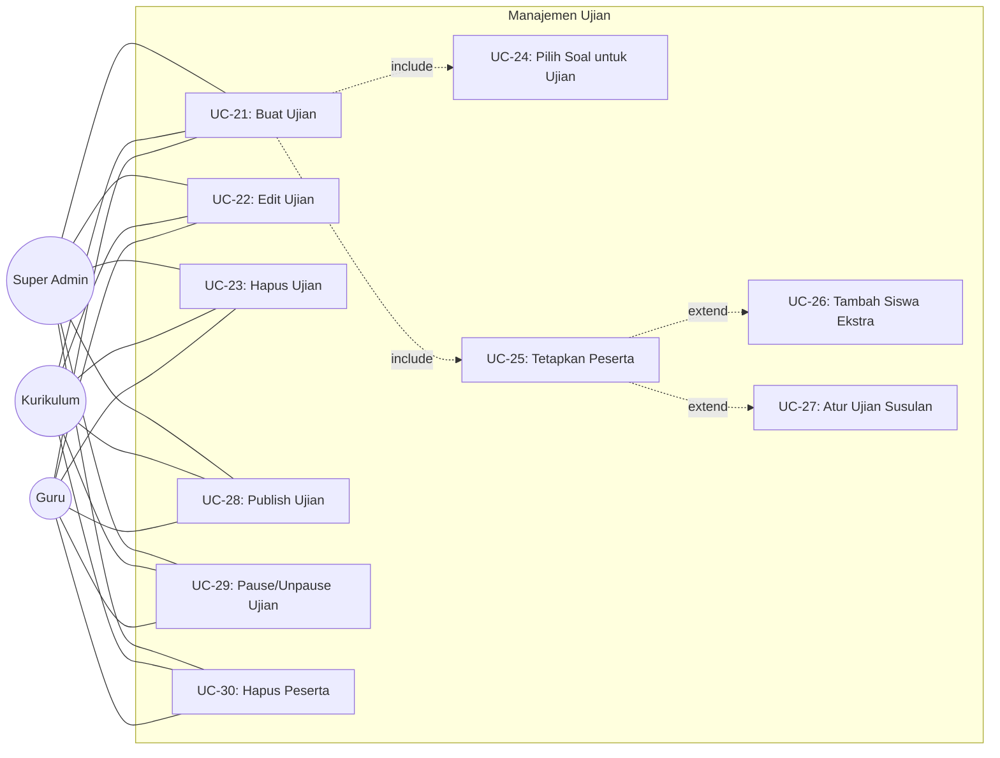

### Modul 6: Pelaksanaan Ujian (Siswa)

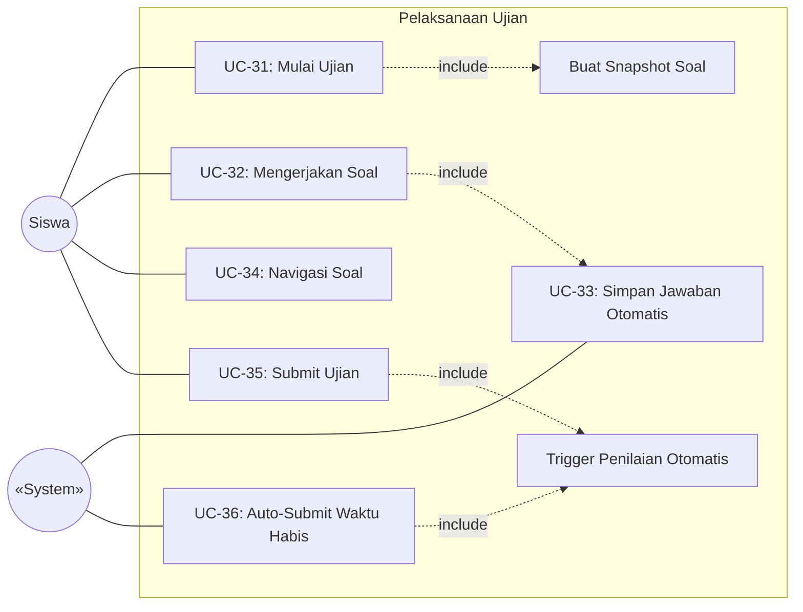

### Modul 7: Monitoring & Pengawasan

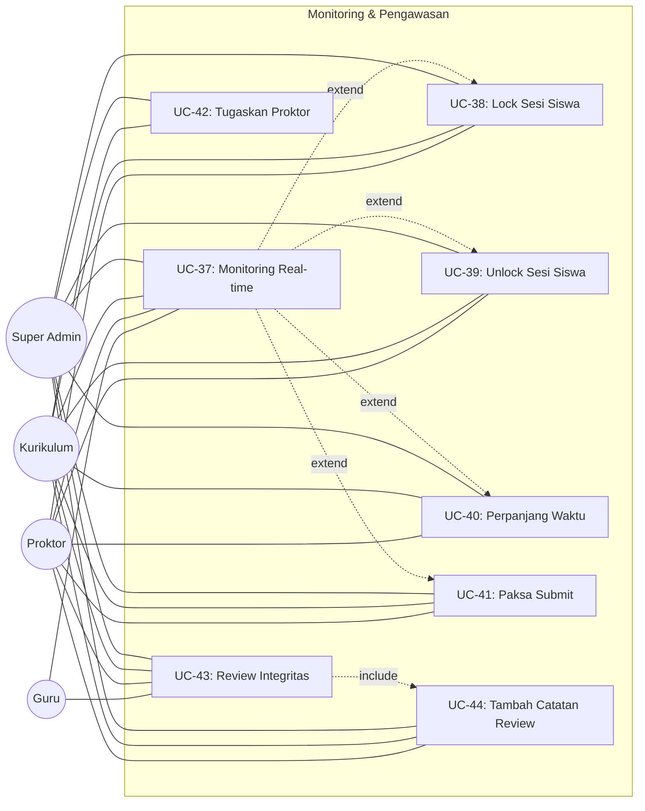

### Modul 8: Penilaian & Hasil

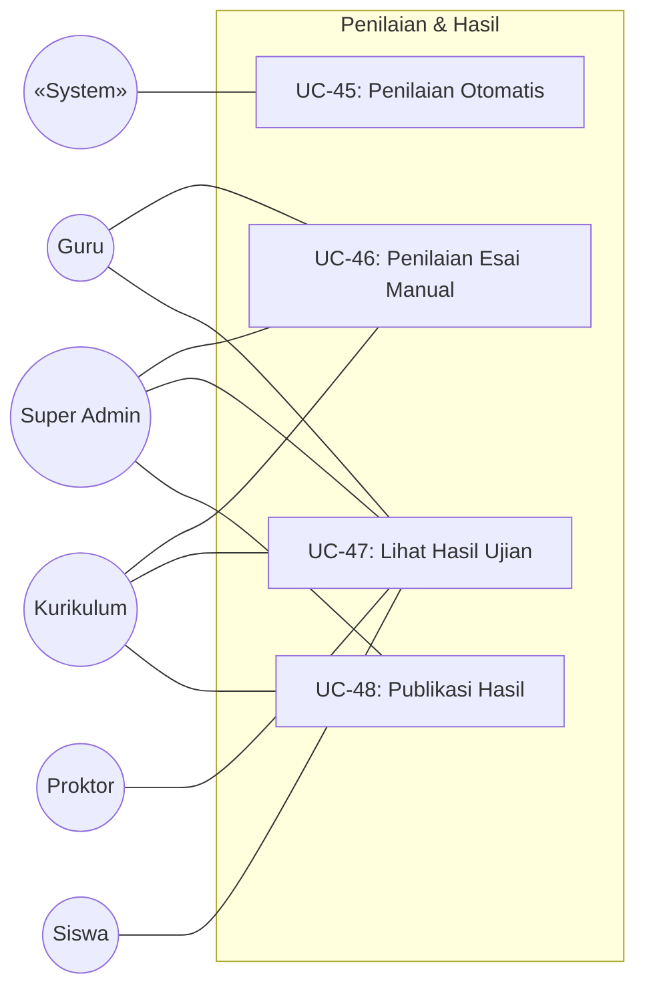

### Modul 9: Analitik & Pelaporan

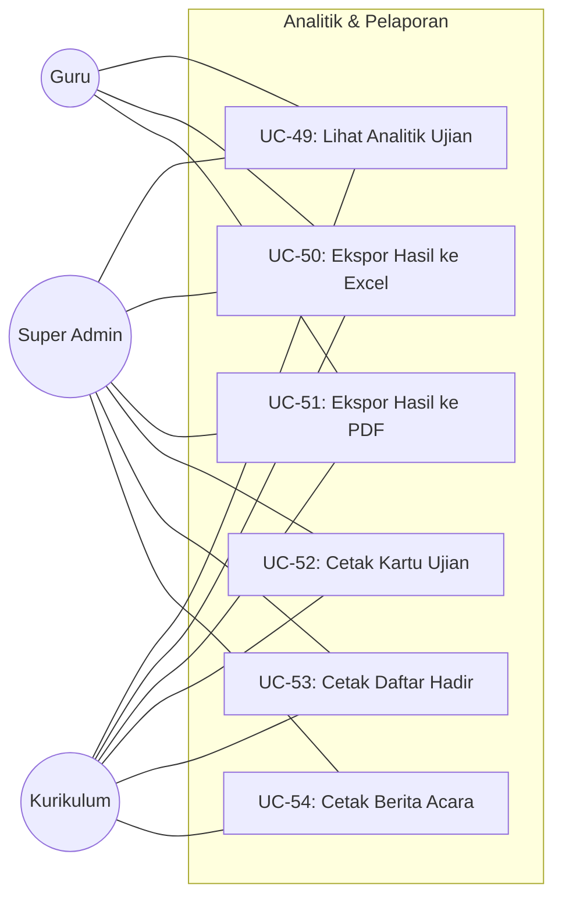

### Modul 10: Keamanan & Sistem

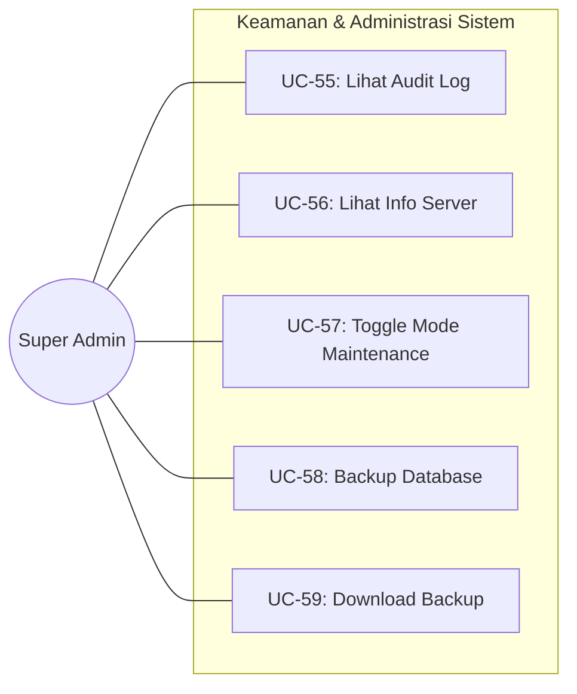

---

## Tabel Deskripsi Use Case

### UC-01 sampai UC-04: Autentikasi

| ID | Use Case | Aktor | Deskripsi | Pre-Condition | Post-Condition |
|---|---|---|---|---|---|
| UC-01 | Login | Semua | Pengguna masuk ke sistem menggunakan username dan password | Akun sudah terdaftar dan aktif | Session login aktif, redirect ke dashboard |
| UC-02 | Logout | Semua | Pengguna keluar dari sistem | Sudah login | Session dihapus, redirect ke halaman login |
| UC-03 | Edit Profil | Semua | Pengguna mengubah nama, email, atau foto profil | Sudah login | Data profil diperbarui di database |
| UC-04 | Ganti Password | Semua | Pengguna mengubah kata sandi lama ke baru | Sudah login, tahu password lama | Password di-hash ulang dan disimpan |

### UC-05 sampai UC-08: Master Data

| ID | Use Case | Aktor | Deskripsi | Pre-Condition | Post-Condition |
|---|---|---|---|---|---|
| UC-05 | Kelola Tahun Ajaran | Super Admin, Kurikulum | CRUD data tahun ajaran beserta semester | Sudah login dengan role yang sesuai | Data tahun ajaran tersimpan/diperbarui/dihapus |
| UC-06 | Kelola Jurusan | Super Admin, Kurikulum | CRUD data jurusan/program keahlian | Sudah login dengan role yang sesuai | Data jurusan tersimpan/diperbarui/dihapus |
| UC-07 | Kelola Kelas/Rombel | Super Admin, Kurikulum | CRUD rombongan belajar dengan relasi jurusan & tahun ajaran | Sudah login, jurusan & tahun ajaran tersedia | Data kelas tersimpan/diperbarui/dihapus |
| UC-08 | Kelola Mata Pelajaran | Super Admin, Kurikulum | CRUD mata pelajaran dengan relasi kelas/tingkat | Sudah login dengan role yang sesuai | Data mata pelajaran tersimpan/diperbarui/dihapus |

### UC-09 sampai UC-12: Pengguna

| ID | Use Case | Aktor | Deskripsi | Pre-Condition | Post-Condition |
|---|---|---|---|---|---|
| UC-09 | Kelola Data Guru | Super Admin, Kurikulum | CRUD data guru beserta penugasan mapel dan kelas | Sudah login, mata pelajaran & kelas tersedia | Data guru + akun user tersimpan |
| UC-10 | Kelola Data Siswa | Super Admin, Kurikulum | CRUD data siswa beserta penempatan kelas | Sudah login, kelas tersedia | Data siswa + akun user tersimpan |
| UC-11 | Import Siswa via Excel | Super Admin, Kurikulum | Upload file Excel untuk menambah banyak siswa sekaligus | File Excel sesuai template | Siswa baru dibuat beserta akun login |
| UC-12 | Kelola Staf | Super Admin, Kurikulum | CRUD data staf (kurikulum, proktor, admin tambahan) | Sudah login sebagai Super Admin | Data staf + role tersimpan |

### UC-13 sampai UC-20: Bank Soal

| ID | Use Case | Aktor | Deskripsi | Pre-Condition | Post-Condition |
|---|---|---|---|---|---|
| UC-13 | Kelola Bank Soal | Super Admin, Kurikulum, Guru | CRUD bank soal (koleksi soal berdasarkan mapel & kelas) | Sudah login | Bank soal tersimpan di database |
| UC-14 | Buat Soal | Super Admin, Kurikulum, Guru | Membuat soal baru (PG, PG Kompleks, B/S, Menjodohkan, Esai) dengan opsi & kunci jawaban | Bank soal sudah ada | Soal + opsi + versi tersimpan (status: DRAFT) |
| UC-15 | Edit Soal | Super Admin, Kurikulum, Guru | Mengubah konten soal yang ada | Soal ada, user berhak (ownership) | Versi baru dibuat, soal diperbarui |
| UC-16 | Hapus Soal | Super Admin, Kurikulum, Guru | Menghapus soal dari bank soal | Soal belum digunakan di ujian aktif | Soal dihapus dari database |
| UC-17 | Publish/Draft Soal | Super Admin, Kurikulum, Guru | Mengubah status soal antara DRAFT ↔ PUBLISHED | Soal ada | Status diperbarui |
| UC-18 | Preview Soal | Super Admin, Kurikulum, Guru | Melihat tampilan soal seperti yang dilihat siswa | Soal ada | Halaman preview ditampilkan |
| UC-19 | Lihat Riwayat Versi | Super Admin, Kurikulum, Guru | Melihat histori perubahan soal | Soal ada | Daftar versi ditampilkan |
| UC-20 | Upload Media Soal | Super Admin, Kurikulum, Guru | Menambahkan gambar/audio ke soal atau opsi | Soal sedang dibuat/diedit | File tersimpan di storage, path di database |

### UC-21 sampai UC-30: Ujian

| ID | Use Case | Aktor | Deskripsi | Pre-Condition | Post-Condition |
|---|---|---|---|---|---|
| UC-21 | Buat Ujian | Super Admin, Kurikulum, Guru | Membuat ujian baru (judul, mapel, jadwal, durasi, token, opsi) | Sudah login, soal & kelas tersedia | Ujian tersimpan (status: DRAFT) |
| UC-22 | Edit Ujian | Super Admin, Kurikulum, Guru | Mengubah konfigurasi ujian | Ujian status DRAFT/PAUSED | Ujian diperbarui |
| UC-23 | Hapus Ujian | Super Admin, Kurikulum, Guru | Menghapus ujian beserta relasinya | Ujian status DRAFT | Ujian dihapus |
| UC-24 | Pilih Soal untuk Ujian | Super Admin, Kurikulum, Guru | Memilih soal dari bank soal ke ujian | Ujian ada, soal PUBLISHED tersedia | Relasi exam_questions tersimpan |
| UC-25 | Tetapkan Peserta | Super Admin, Kurikulum, Guru | Menetapkan peserta per kelas atau per siswa | Ujian ada, kelas/siswa tersedia | Relasi exam_participants tersimpan |
| UC-26 | Tambah Siswa Ekstra | Super Admin, Kurikulum, Guru | Menambahkan siswa di luar kelas yang terdaftar | Ujian ada | Peserta individual ditambahkan |
| UC-27 | Atur Ujian Susulan | Super Admin, Kurikulum, Guru | Mengatur jadwal khusus ujian susulan per siswa | Ujian ada, siswa sudah terdaftar | Jadwal susulan tersimpan |
| UC-28 | Publish Ujian | Super Admin, Kurikulum, Guru | Mengubah status ujian dari DRAFT ke PUBLISHED | Ujian punya soal & peserta | Status berubah, tombol manajemen terkunci |
| UC-29 | Pause/Unpause Ujian | Super Admin, Kurikulum, Guru | Menangguhkan/melanjutkan ujian yang sedang berlangsung | Ujian status PUBLISHED | Status berubah ke PAUSED/kembali PUBLISHED |
| UC-30 | Hapus Peserta | Super Admin, Kurikulum, Guru | Menghapus peserta terdaftar dari ujian | Ujian status DRAFT/PAUSED, peserta terdaftar | Peserta dihapus dari relasi |

### UC-31 sampai UC-36: Pelaksanaan Ujian

| ID | Use Case | Aktor | Deskripsi | Pre-Condition | Post-Condition |
|---|---|---|---|---|---|
| UC-31 | Mulai Ujian | Siswa | Siswa memulai sesi ujian | Ujian PUBLISHED, dalam jadwal, siswa eligible | Attempt dibuat, snapshot soal dibuat |
| UC-32 | Mengerjakan Soal | Siswa | Siswa memilih/menulis jawaban untuk setiap soal | Sesi ujian aktif (IN_PROGRESS) | Jawaban disimpan di participant_answers |
| UC-33 | Simpan Jawaban Otomatis | System | Jawaban di-autosave setiap kali berubah | Sesi aktif, koneksi tersedia | Jawaban tersimpan tanpa klik manual |
| UC-34 | Navigasi Soal | Siswa | Berpindah antar soal (next, prev, nomor soal) | Sesi ujian aktif | Halaman soal berganti |
| UC-35 | Submit Ujian | Siswa | Siswa menyelesaikan dan mengirim seluruh jawaban | Sesi aktif | Status → SUBMITTED, grading di-trigger |
| UC-36 | Auto-Submit Waktu Habis | System | Sistem otomatis submit saat deadline terlewat | Deadline terlewat, sesi masih IN_PROGRESS | Status → AUTO_SUBMITTED, grading di-trigger |

### UC-37 sampai UC-44: Monitoring

| ID | Use Case | Aktor | Deskripsi | Pre-Condition | Post-Condition |
|---|---|---|---|---|---|
| UC-37 | Monitoring Real-time | Super Admin, Kurikulum, Guru, Proktor | Melihat dashboard peserta aktif, progress, status online | Ujian sedang berlangsung | Dashboard real-time ditampilkan |
| UC-38 | Lock Sesi Siswa | Super Admin, Kurikulum, Proktor | Mengunci layar ujian siswa tertentu | Siswa sedang mengerjakan ujian | Layar siswa terkunci, tidak bisa menjawab |
| UC-39 | Unlock Sesi Siswa | Super Admin, Kurikulum, Proktor | Membuka kunci layar ujian siswa | Sesi siswa dalam keadaan locked | Siswa bisa melanjutkan ujian |
| UC-40 | Perpanjang Waktu | Super Admin, Kurikulum, Proktor | Menambah menit tambahan untuk siswa tertentu | Sesi siswa aktif | Deadline diperpanjang |
| UC-41 | Paksa Submit | Super Admin, Kurikulum, Proktor | Memaksa submit jawaban siswa | Sesi siswa aktif | Jawaban di-submit, sesi berakhir |
| UC-42 | Tugaskan Proktor | Super Admin, Kurikulum | Menetapkan proktor ke ujian tertentu | Ujian ada, user proktor tersedia | Proktor ditugaskan |
| UC-43 | Review Integritas | Super Admin, Kurikulum, Guru, Proktor | Melihat detail sinyal integritas siswa | Integrity events tercatat | Detail pelanggaran ditampilkan |
| UC-44 | Tambah Catatan Review | Super Admin, Kurikulum, Proktor | Menulis catatan terkait pelanggaran siswa | Halaman review terbuka | Catatan tersimpan di database |

### UC-45 sampai UC-48: Penilaian

| ID | Use Case | Aktor | Deskripsi | Pre-Condition | Post-Condition |
|---|---|---|---|---|---|
| UC-45 | Penilaian Otomatis | System | Sistem menghitung skor soal objektif berdasarkan snapshot | Jawaban tersubmit | Skor per soal & total skor dihitung |
| UC-46 | Penilaian Esai Manual | Super Admin, Kurikulum, Guru | Guru memberikan skor manual untuk soal esai | Ada jawaban esai yang belum dinilai | Skor esai tersimpan, status grading diperbarui |
| UC-47 | Lihat Hasil Ujian | Semua | Melihat daftar hasil/skor peserta ujian | Ujian sudah selesai/tersubmit | Tabel hasil ditampilkan |
| UC-48 | Publikasi Hasil | Super Admin, Kurikulum | Membuat hasil ujian bisa dilihat oleh siswa | Semua jawaban sudah dinilai | Siswa bisa melihat hasil mereka |

### UC-49 sampai UC-54: Pelaporan

| ID | Use Case | Aktor | Deskripsi | Pre-Condition | Post-Condition |
|---|---|---|---|---|---|
| UC-49 | Lihat Analitik Ujian | Super Admin, Kurikulum, Guru | Melihat statistik, distribusi nilai, analisis butir soal | Ujian sudah dinilai | Grafik dan statistik ditampilkan |
| UC-50 | Ekspor Hasil ke Excel | Super Admin, Kurikulum, Guru | Download file .xlsx berisi hasil ujian | Ujian sudah dinilai | File Excel terunduh |
| UC-51 | Ekspor Hasil ke PDF | Super Admin, Kurikulum, Guru | Download file .pdf berisi laporan hasil | Ujian sudah dinilai | File PDF terunduh |
| UC-52 | Cetak Kartu Ujian | Super Admin, Kurikulum | Cetak kartu ujian per kelas | Kelas & siswa tersedia | Halaman cetak kartu ditampilkan |
| UC-53 | Cetak Daftar Hadir | Super Admin, Kurikulum | Cetak daftar hadir ujian | Ujian & peserta tersedia | Halaman cetak absensi ditampilkan |
| UC-54 | Cetak Berita Acara | Super Admin, Kurikulum | Cetak berita acara pelaksanaan ujian | Ujian tersedia | Halaman cetak berita acara ditampilkan |

### UC-55 sampai UC-60: Sistem

| ID | Use Case | Aktor | Deskripsi | Pre-Condition | Post-Condition |
|---|---|---|---|---|---|
| UC-55 | Lihat Audit Log | Super Admin | Melihat jejak audit semua aktivitas admin | Login sebagai Super Admin | Daftar audit log ditampilkan |
| UC-56 | Lihat Info Server | Super Admin | Melihat informasi PHP, database, disk, uptime | Login sebagai Super Admin | Halaman info server ditampilkan |
| UC-57 | Toggle Maintenance | Super Admin | Mengaktifkan/menonaktifkan mode maintenance | Login sebagai Super Admin | Sistem masuk/keluar mode maintenance |
| UC-58 | Backup Database | Super Admin | Menjalankan backup database secara manual | Login sebagai Super Admin | File backup dibuat |
| UC-59 | Download Backup | Super Admin | Mengunduh file backup terakhir | Backup sudah pernah dibuat | File backup terunduh |
| UC-60 | Lihat Dashboard | Semua | Melihat ringkasan statistik sesuai peran | Sudah login | Dashboard dengan data relevan ditampilkan |

---

*Dokumen Use Case ini merupakan bagian dari dokumentasi teknis SAPTA CBT.*
*Terakhir diperbarui: September 2026.*
